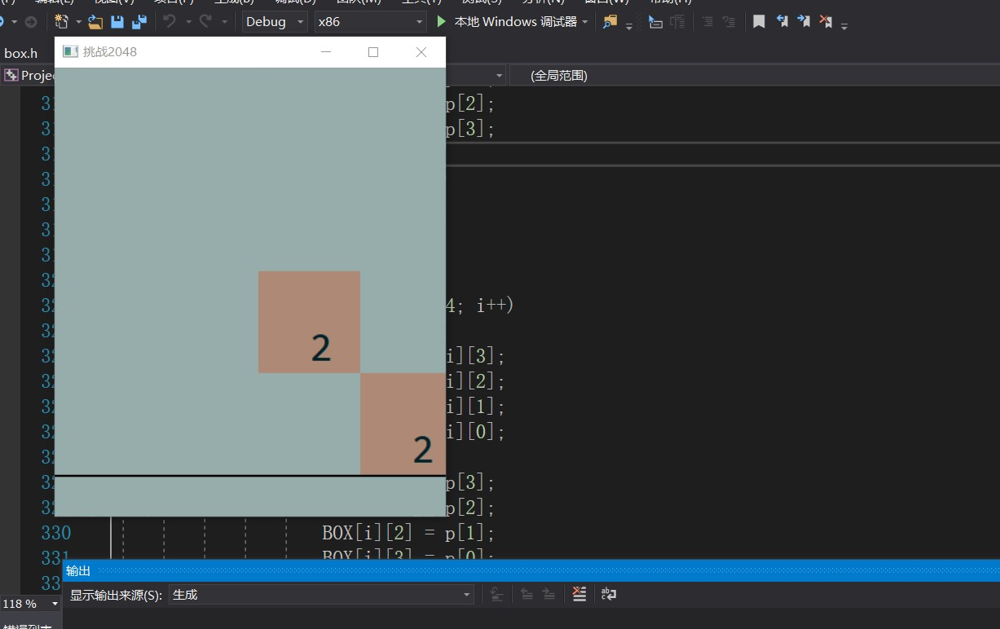
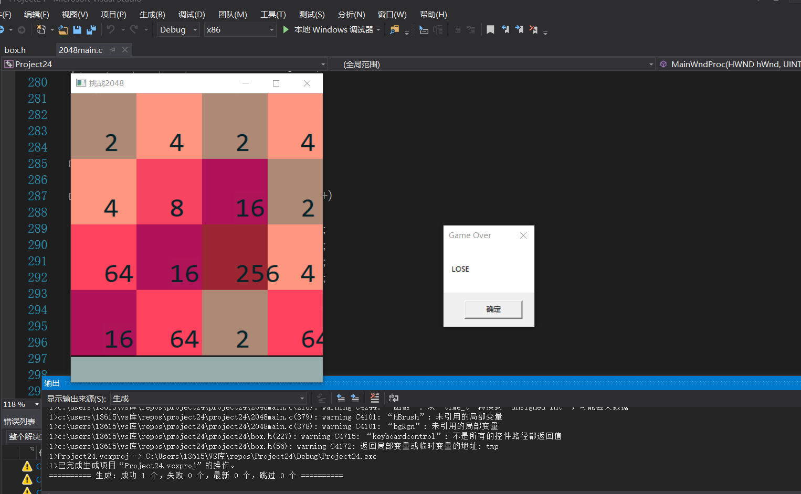
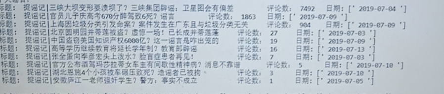

# 2019-  
# GDI绘图之2048小游戏  
共有两个资源文件，box.h里是2048用到的所有函数及其实现，2048main.c是GDI绘图的过程  
首先绘制窗口，调用repaint函数，将窗口分块，而后回收画笔画刷  
smallflag判断是否是初次生成随机数，是则调用两次smallpaint在随机位置生成随机数，否则调用一次，释放内存DC  
接下来通过键盘触发事件，按照2048的规则，每一次按键后做出相应运算  
通过COVER来设置不同数字对应的颜色，通过TEXTOUT函数输出  
## 游戏运行过程  
### 初始状态下生成两个随机数  

### 游戏结束
  
# 十大谣言爬虫  
在chrome上打开捉谣记，下拉20次页面，每次休眠8秒，将保存下来的html文档存于变量html内，通过xpath读取30条新闻的标题，点赞数和发行时间，并将它们存于temp列表中，tempname_and_goods是用来保存temp列表的列表，将他们根据点赞数排序后输出。  
  
